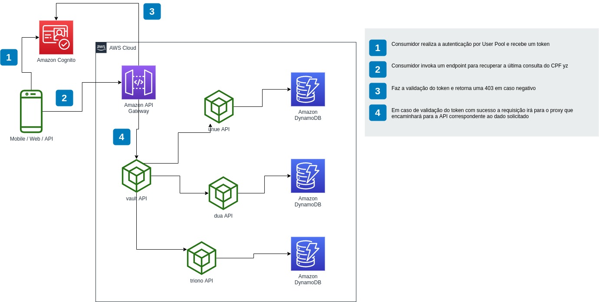

# Objetivo
> Este projeto tem como objetivo simular um ambiente com dados protegido e 
> prover um mecanismo de acesso aos dados.

# Fluxo macro

# APIs
- [unue](unue/README.md) - Acesso para os dados altamente sensíveis
- [due](due/README.md) - Acesso para os dados sensíveis
- [triono](triono/README.md) - Acesso para os dados corriqueiro
